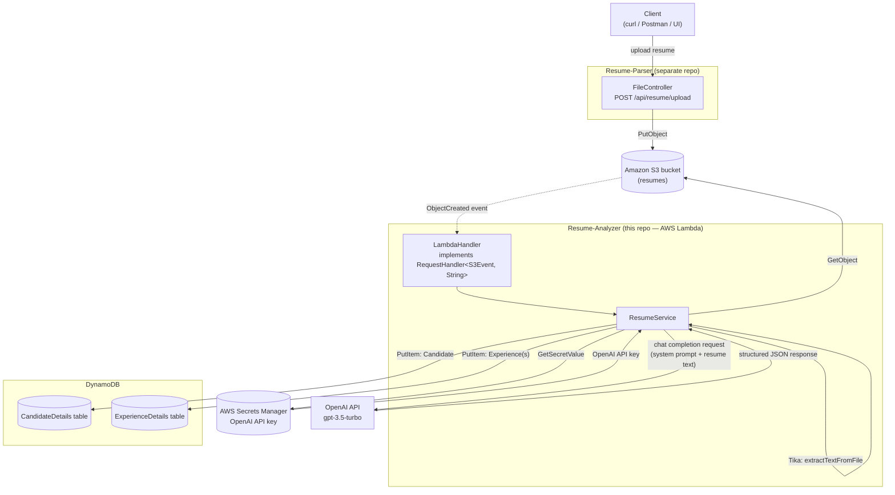

# Resume-Analyzer

An AWS Lambda function (packaged from a Spring Boot app) that's triggered whenever a resume lands in S3, extracts its text, sends it to OpenAI to be structured into candidate/experience data, and persists the result to DynamoDB.

This is the **second half** of a two-service pipeline — resumes arrive here via [Resume-Parser](https://github.com/Rezon669/Resume-Parser), a separate upload API that pushes files to S3.

---

## ✨ Features

- **Event-driven, not request-driven** — no REST endpoint; triggered directly by S3 `ObjectCreated` events, so there's no polling or manual invocation needed.
- **Format-agnostic text extraction** via Apache Tika (`tika-app` + `tika-parsers-standard-package`), so it handles PDF, DOC, and DOCX uniformly without format-specific parsing code.
- **LLM-based structuring** — sends the raw resume text to OpenAI (`gpt-3.5-turbo`) with a configurable system prompt, and parses the model's JSON response into typed `Candidate` and `Experience` records (name, email, phone, location, total experience, skills, and a list of past roles with company/position/duration/responsibilities).
- **Secrets Manager integration** — the OpenAI API key is fetched at runtime from AWS Secrets Manager rather than being hardcoded or passed as a plain environment variable.
- **Dual-table persistence** — writes normalized data into two DynamoDB tables (`CandidateDetails`, `ExperienceDetails`), linked by a generated `candidateId`, rather than one denormalized blob.
- **Packaged as a fat/shaded JAR** specifically for Lambda deployment (Maven Shade plugin + `aws-serverless-java-container-springboot3`), with `LambdaHandler` as the entry point.

---

## 🏗️ Architecture — full pipeline (both repos)



**Event flow (`LambdaHandler.handleRequest`)**

1. S3 emits an `ObjectCreated` event when a resume is uploaded (by Resume-Parser or directly).
2. `LambdaHandler` iterates the event's records and, for each one, calls `ResumeService.handleResumeUpload(bucket, key)`.
3. `ResumeService`:
   - Downloads the object from S3 (`GetObjectRequest`).
   - Extracts plain text using Apache Tika, format-agnostically.
   - Fetches the OpenAI API key from Secrets Manager (`fetchApiKey()`), using a secret name and a system prompt both supplied via Lambda environment variables (`SECRET_NAME`, `PROMPT`).
   - Sends the resume text to OpenAI's chat completions endpoint with that system prompt, asking the model to return structured JSON.
   - Parses the response into a `Candidate` (with a newly generated `candidateId`) and a list of `Experience` records.
   - Writes both to DynamoDB via `PutItemRequest` — one call per candidate, one call per experience entry.

---

## 🧰 Tech Stack

| Layer | Technology |
|---|---|
| Language / Runtime | Java 17 |
| Framework | Spring Boot 3.5.4 (dependencies only — no web server; runs as a Lambda) |
| Compute | AWS Lambda (`RequestHandler<S3Event, String>`) |
| Text Extraction | Apache Tika 2.9.1 |
| LLM | OpenAI Chat Completions API (`gpt-3.5-turbo`), called directly via `RestTemplate` |
| Secrets | AWS Secrets Manager |
| Storage | Amazon S3 (source), DynamoDB (`CandidateDetails`, `ExperienceDetails`) |
| Packaging | Maven Shade Plugin (fat JAR), `aws-serverless-java-container-springboot3` |
| JSON | Jackson (`ObjectMapper`, `JsonNode`) |

---

## 📦 Data Model

**Candidate** (→ `CandidateDetails` table)
| Field | Type | Notes |
|---|---|---|
| candidateId | String | Generated UUID, partition key |
| name, email, phone, location | String | Extracted by the LLM |
| totalExp | String | e.g. "5 years" |
| skills | List\<String\> | |

**Experience** (→ `ExperienceDetails` table)
| Field | Type | Notes |
|---|---|---|
| experienceId | String | Generated UUID, partition key |
| candidateId | String | Foreign key back to the candidate |
| company, position, duration | String | |
| responsibilities | List\<String\> | |

---

## ⚙️ Getting Started / Deployment

### Prerequisites
- Java 17+, Maven
- An AWS account with:
  - An S3 bucket configured to send `ObjectCreated` event notifications to this Lambda
  - DynamoDB tables `CandidateDetails` and `ExperienceDetails`
  - A Secrets Manager secret containing `{"openai_api_key": "sk-..."}`
  - An IAM execution role for the Lambda with permissions for S3 read, DynamoDB write, and Secrets Manager read

### Build the deployable JAR
```bash
./mvnw clean package
```
This produces a shaded (fat) JAR via the Maven Shade plugin, with `com.app.resumeanalyzer.handler.LambdaHandler` set as the entry point in the manifest — upload this JAR directly as your Lambda deployment package.

### Configure Lambda environment variables
| Variable | Purpose |
|---|---|
| `SECRET_NAME` | Name/ARN of the Secrets Manager secret holding the OpenAI API key |
| `PROMPT` | System prompt instructing the model how to structure the resume JSON (fields, format) |

### Wire up the S3 trigger
In the S3 bucket's event notification settings, add a trigger for `s3:ObjectCreated:*` pointing at this Lambda function.

---

## 🔗 Related

- [Resume-Parser](https://github.com/Rezon669/Resume-Parser) — the upload-facing REST API that pushes resumes into the S3 bucket this Lambda listens to.
